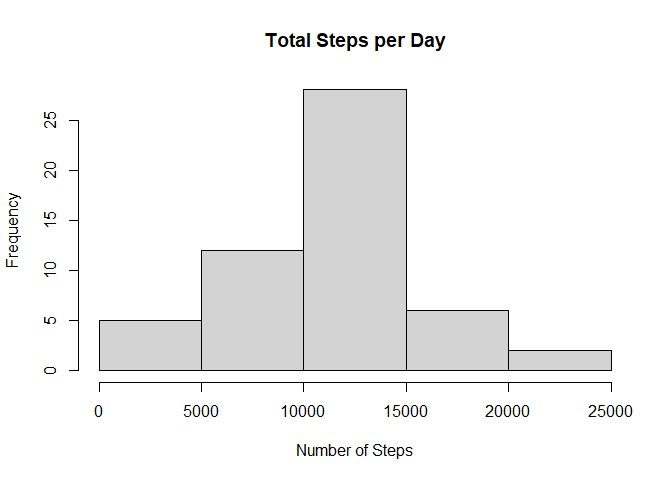

## Loading and preprocessing the data

```r
activity<-read.csv(file= "activity.csv",header=TRUE)
```

## What is mean total number of steps taken per day?


```r
totalSteps <- aggregate(steps ~ date, activity, FUN=sum)
```

# histogram of the total number of steps taken per day


```r
hist(totalSteps$steps,
     main = "Total Steps per Day",
     xlab = "Number of Steps")
```

<!-- -->

```r
meanSteps <- mean(totalSteps$steps, na.rm = TRUE)
medSteps <- median(totalSteps$steps, na.rm = TRUE)

meanSteps
```

```
## [1] 10766.19
```

```r
medSteps
```

```
## [1] 10765
```

## What is the average daily activity pattern?


```r
library(ggplot2)
meanStepsByInt <- aggregate(steps ~ interval, activity, mean)
ggplot(data = meanStepsByInt, aes(x = interval, y = steps)) +
  geom_line() +
  ggtitle("Average Daily Activity Pattern") +
  xlab("5-minute Interval") +
  ylab("Average Number of Steps") +
  theme(plot.title = element_text(hjust = 0.5))
```

<!-- -->
  

```r
# Which 5-minute interval across all days contain the maximum number of steps
maxInt <- meanStepsByInt[which.max(meanStepsByInt$steps),]
```

## Imputing missing values

#calculate missing values


```r
missingVals <- is.na(activity$steps)
```

# Create a new dataset that is equal to the original dataset but with 
# the missing data filled in.


```r
imp_activity <- transform(activity,
                              steps = ifelse(is.na(activity$steps),
                                             meanStepsByInt$steps[match(activity$interval, 
                                                                        meanStepsByInt$interval)],
                                             activity$steps))
```

# Make a histogram of the total number of steps taken each day and
# and report the mean and median.


```r
impStepsByInt <- aggregate(steps ~ date, imp_activity, FUN=sum)
hist(impStepsByInt$steps,
     main = "Imputed Number of Steps Per Day",
     xlab = "Number of Steps")
```

<!-- -->

## Are there differences in activity patterns between weekdays and weekends?

# Create a new factor variable with two levels - "weekend" and "weekday"


```r
DayType <- function(date) {
  day <- weekdays(date)
  if (day %in% c('Monday', 'Tuesday', 'Wednesday', 'Thursday', 'Friday'))
      return ("weekeday")
  else if (day %in% c('Saturday', 'Sunday'))
      return ("weekend")
  else
      stop ("Invalid Date Format.")
}
imp_activity$date <- as.Date(imp_activity$date)
imp_activity$day <- sapply(imp_activity$date, FUN = DayType)
```

# Make a panel plot containnig a time-series plot of the 5-minute interval
# and the average number of steps taken across all weekdays or weekends

```r
meanStepsByDay <- aggregate(steps ~ interval + day, imp_activity, mean)
ggplot(data = meanStepsByDay, aes(x = interval, y = steps)) + 
  geom_line() +
  facet_grid(day ~ .) +
  ggtitle("Average Daily Activity Pattern") +
  xlab("5-minute Interval") +
  ylab("Average Number of Steps") +
  theme(plot.title = element_text(hjust = 0.5))
```

<!-- -->
